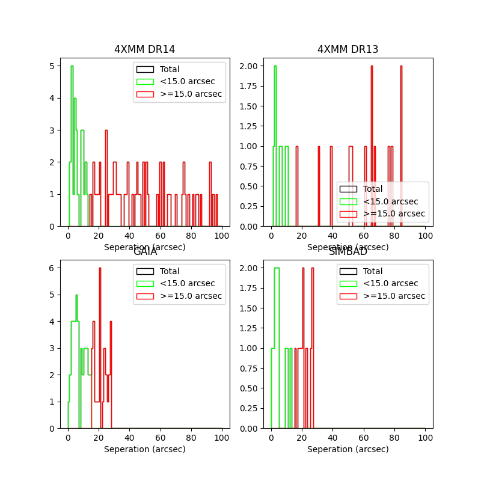
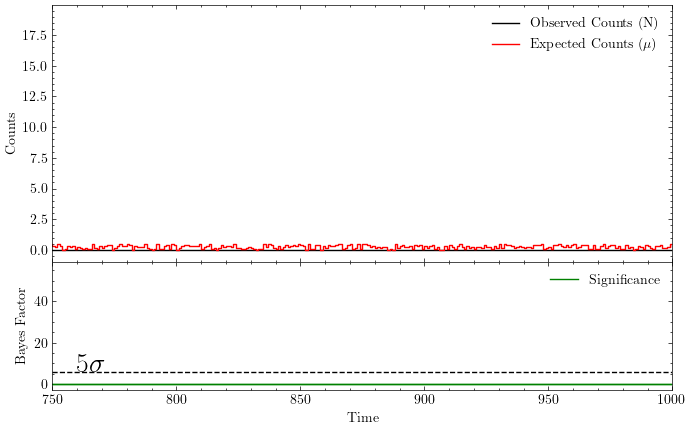
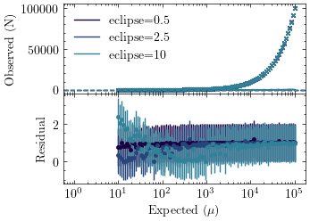
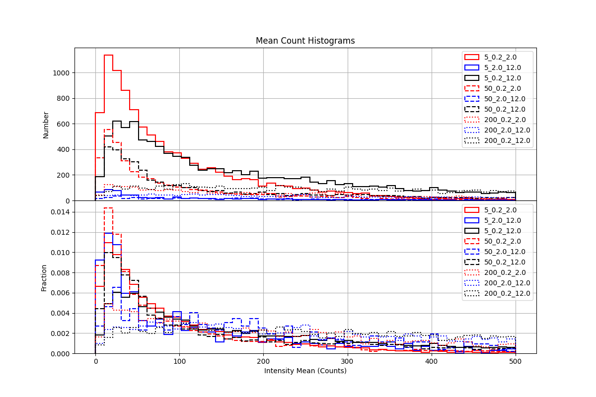
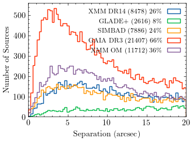
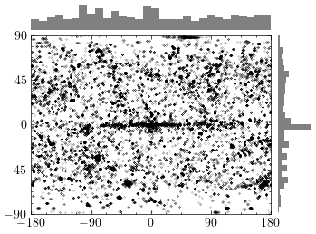
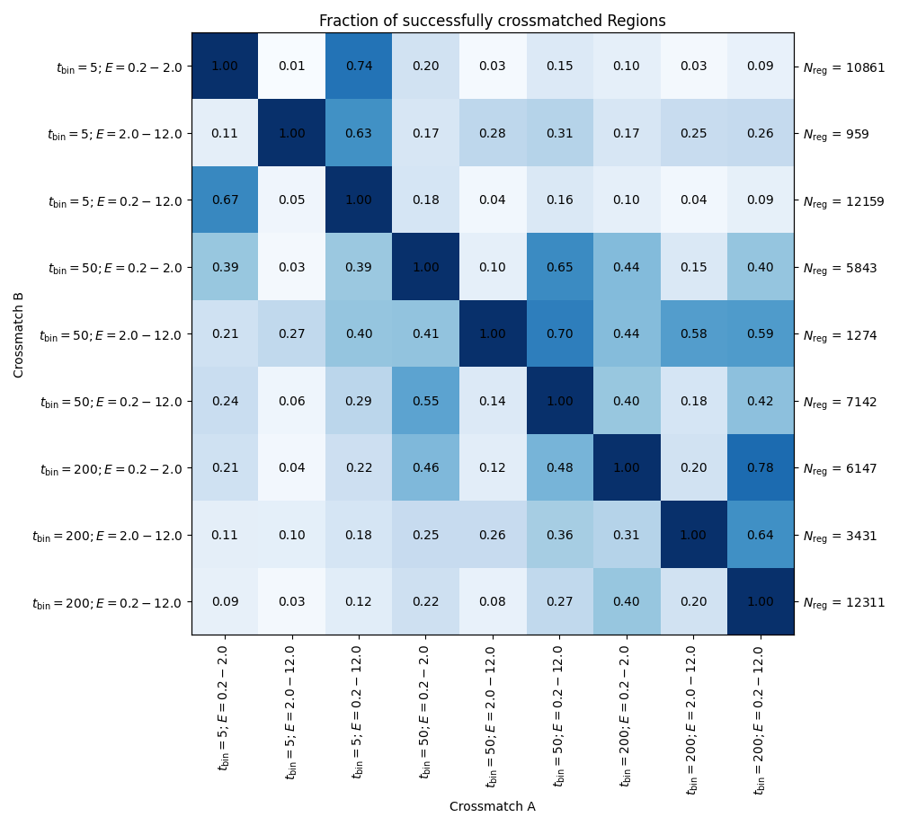
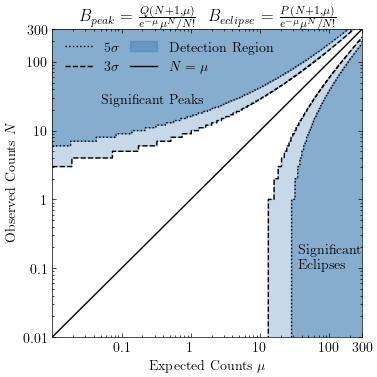

# Plots

## 02_12_spatial_dist.png

## hot_regions_200_s.png

## template_creation.png

## Tornado_burst_spec.png

## tornado_burst_lc_lccorr.png

## hot_regions_5s.png

## double_burst_e2_3943.png

## events_per_time_frame_hist.png

## bayesfactorlimits_3_zoomed.png

## transients_scatter_rotated.png

## crossmatch_seperations.png

## bayes_successrate_timebinning2.png

## otype_seperations.png

## bayesfactorlimits_3.png

## number_of_isolated_flares.png

## transients_hist_rotated.png

## bayes_eclipse_successrate_depth.png

## HD_3447_large.png

## check_eclipse_estimate_success2.png

## B_eclipse.png

## athena_exod.png

## cluster_radius_n_sources.png

## B_values_3d.png

## spatial_dist_0.2_2.0.png

## check_estimate_success1.png

## Significance_plot.png

## tornado_spec_nofit.png

## tornado_burst_lc.png

## source_against_n_counts_filter.png

## check_eclipse_estimate_success1.png

## Flux_comparison.png

## spatial_dist_2.0_12.0.png

## bayes_rate_estimate.png

## bayesfactorlimits_5_zoomed.png

## crossmatch_pie_chart.png

## gaia_hr_diagram.png

## B_peak_threshold_vs_N_reg.png

## total_lc_counts_hist.png

## bayesfactorlimits_5.png

## dr14_offsets.png

## HD_3447.png

## mean_count_histogram.png

## transients.png

## plot_some_n_bayes.png

## crossmatch_sep.png

## B_factor_vs_sigma.png

## HD_3447_zoom.png

## B_eclipse_histogram.png

## unique_reg.png

## check_estimate_success2.png

## B_values_distribution_all_regions.png

## unique_regions_aitoff.png

## benchmarking_side_by_side.png

## HD_200560_lc_10s.png

## accepted_n_values.png

## crossmatch_confusion_matrix.png

## unique_sources.png

## mean_observed_count_rate.png

## hydra_A_spec_lc.png

## data_cube_frame_with_inset_and_box.png

## data_cube_frame.png

## total_lc_counts_hist_small_n.png

## exod_runs_vs_date.png

## bayes_successrate_timebinning1.png

## dr14_cts_hist.png

## SIMBAD_seperations.png

## bayesfactorlimits_3_5.png

## B_peak.png

## B_peak_histogram.png

## N_mu_dist_all_lc.png

## OM_magnitudes.png

## SIMBAD_counterparts_classification.png

## simbad_exod_subclass_piechart.png

## hot_regions_50_s.png

## hot_regions_5_s.png

