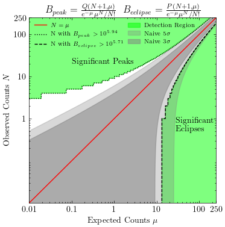
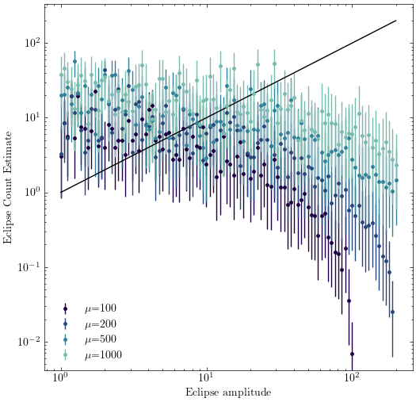
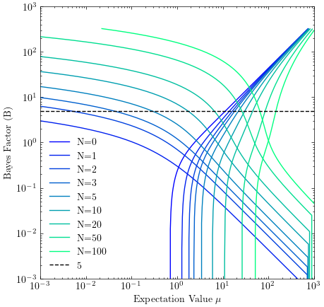
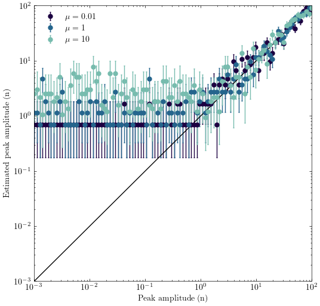

# Plots

## bayesfactorlimits_3_zoomed.png

## bayes_successrate_timebinning2.png

## bayesfactorlimits_3.png

## bayes_eclipse_successrate_depth.png

## check_eclipse_estimate_success2.png

## B_eclipse.png

## B_values_3d.png

## check_estimate_success1.png

## check_eclipse_estimate_success1.png

## bayes_rate_estimate.png

## bayesfactorlimits_5_zoomed.png

## bayesfactorlimits_5.png

## plot_some_n_bayes.png

## check_estimate_success2.png

## accepted_n_values.png

## bayes_successrate_timebinning1.png

## B_peak.png

